# 🚀 AWS Serverless Website Uptime Monitor

## 📋 Overview

A fully serverless, event-driven AWS solution that automatically monitors website availability and sends email alerts when downtime is detected. Built with pay-per-use services for cost efficiency and scalability.

## 🏗️ Architecture

```mermaid
flowchart LR
    A[EventBridge Scheduler] -->|Triggers every 5 min| B[AWS Lambda]
    B -->|HTTP GET Request| C[Target Website]
    C -->|Returns Status| B
    B -->|Log Result| D[(Amazon DynamoDB)]
    B --> E{Check Status?}
    E -->|Status != 200| F[Amazon SNS Topic]
    F --> G[📧 Email Alert]
    E -->|Status == 200| H[No Action]
```

## Core Components

| Service                | Purpose                                     | Key Benefit                                |
| ---------------------- | ------------------------------------------- | ------------------------------------------ |
| **AWS Lambda**         | Executes website checks via HTTP requests   | Serverless, scales automatically           |
| **Amazon EventBridge** | Triggers Lambda every 5 minutes on schedule | Precise scheduling, no servers to manage   |
| **Amazon DynamoDB**    | Stores all check results with timestamps    | Fully managed NoSQL, fast queries          |
| **Amazon SNS**         | Sends email alerts when site is down        | Reliable notifications, multiple endpoints |

## Features

- **24/7 Automated Monitoring** - Runs checks every 5 minutes
- **Instant Email Alerts** - Get notified within minutes of downtime
- **Historical Logging** - All results stored in DynamoDB for analysis
- **Cost-Effective** - Pay-per-use model, typically <$1/month
- **Serverless** - No servers to provision, patch, or maintain

## Step by Step Service creation with Screenshot attached

### Step 1 - Create DynamoDB Table and see the table created when Website status is changes.

### Step 2 - Create SNS Topic and send immediate notification to the attached email.

### Step 3 - Create Lambda Function and see the logs when the website is down.

### Step 4 - Notify the email when the website is down.

## 
